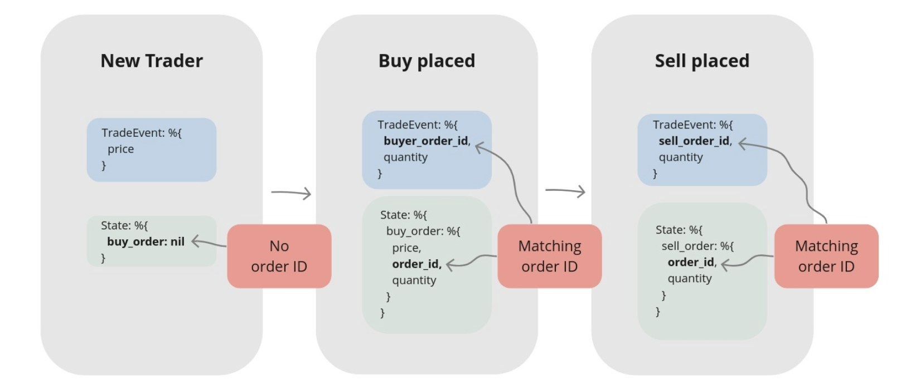
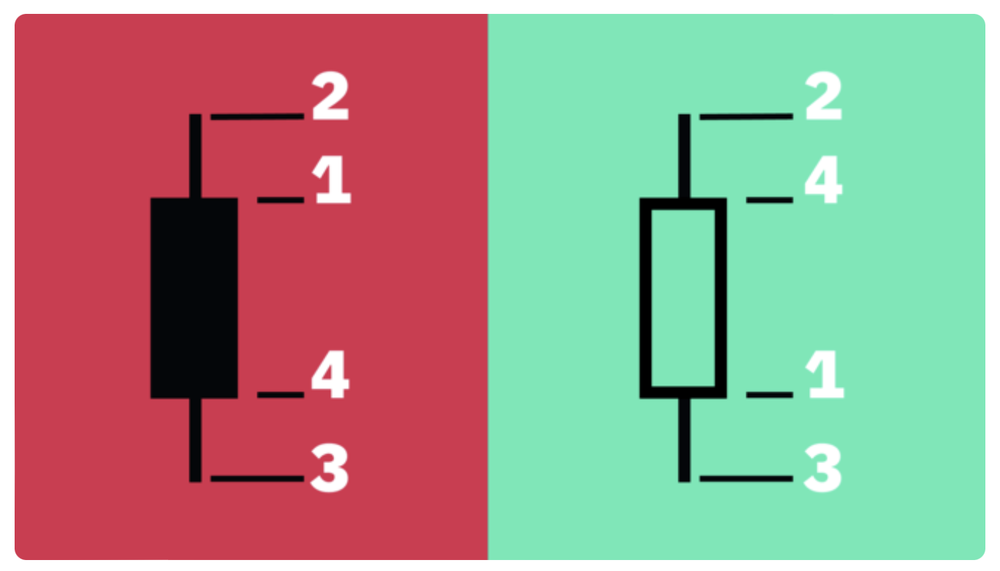

# Notes
in chapter one they suggest that to be tested later, but we can add a binance mock 
account: https://testnet.binance.vision

I will use a rule of only read one link depth, meaning that I will not matter if a links goes to another link, I will 
read only the first link

# Links
## Chapter 1
[binance websocket documentation](https://github.com/binance/binance-spot-api-docs/blob/master/web-socket-streams.md)
[binance testenet](https://testnet.binance.vision)
[repo source code](https://github.com/Cinderella-Man/hands-on-elixir-and-otp-cryptocurrency-trading-bot-source-code)
[book](https://book.elixircryptobot.com/)

## Chapter 4
[understanding candlestick](https://academy.binance.com/en/articles/a-beginners-guide-to-candlestick-charts)

# Extras
when using [vim](https://vi.stackexchange.com/questions/4307/multiple-cursors-at-desired-location), and we need to make a repeatable change, we should find a way to search the pattern and apply the change with the `.` command

 The magic formula in Vim is n.. A really cool workflow is:

* search for the place you want to make an edit with /pattern
* make your repeatable edit
* use n to go to the next place to edit
* use . to repeat the edit
* repeat the last two steps: You're the king of the world (or at least of edits)

# Chapters
## Chapter 1
Elixir is usually easy to understand, so when the documentation is light we must not be afraid of take a look of to the source code 

here we review the commands to handle some project organization like 
* `iex -S mix`: run the project in 'interactive' mode
* `mix deps.get`: bring dependencies from the mix file
* `mix format`: organize the project with a 'linter'
* `mix new streamer --sup`: creates a new project with a supervisor structure

## Chapter 2
when using the word `use` in a module we usually need to fullfill the contract, in
the case of the genserver `start_link/1` allow us to register a process  with a name

the trader needs to known
* what symbol to trade, this means like XRPUSDT which means i will change XRP to USDT
* placed buy order (if any)
* place sell order (if any)
* profit interval (what net profit % we would like to achieve when buying and selling the asset in one cycle)
* tick_size is how the smallest and biggest unit that we can 'divide' the 'symbol' for example, in dollars the minimal unit are cents, TODO: finish [reading](https://www.investopedia.com/terms/t/tick.asp), the tick size is a movement indicator, it can tell us if the transaction occurred at a higher or lower price

* the decimal module will allow us to overcome problems with the precision

---

the trader will have 3 states:
* without orders (sell or buy)
* with a sell order placed 
* with a buy order placed 

in the mix.exs of the root directory, putting a dependency there does not mean that will be available for the apps inside the umbrella, configuration is needed, that said, there are some packages 

* new_trader: does not have any open order cause no `buy_order` is there
* buy_order_placed: arrives a order_id matching our buy_order_id
* sell_order_placed: arrives a order_id matching our sell_order_id, here the trader can exit

the function `calculate_sell_price/3` works in the next way:
  * first the fee is harcoded and is equivalent to 0.1%
  * `original_price` is the buy price adding it the fee.
  * we grow the `original_price` with the `profit_interval` giving us the result of `net_target_price`
  * thus there is commision for selling we need to add a fee to the `net_target_price` giving us the result of the `gross_target_price`
  * we need to normalze the price since binance wont accept prices that are not divisible by the symbols.

I have tested using the binance [testnet](https://testnet.binance.vision) and looks like it worked,

I am comparing my branch with the remote with franton to see differences
  

## Chapter 3

only one proccess can be registered under a single name.

## Chapter 4
the candlesticks represents any period, from seconds to years

1) Open — The first recorded trading price of the asset within that particular timeframe.
2) High — The highest recorded trading price of the asset within that particular timeframe.
3) Low — The lowest recorded trading price of the asset within that particular timeframe.
4) Close — The last recorded trading price of the asset within that particular timeframe.

the distance beetween open a close is called body, is the part that looks "filled" and the distance beetween high and low is called `shadow`, longer bodies means that there was a intense buying and selling pressures.

Heikin-Ashi candlesticks uses the average, combine them with the traditional candlesticks to avoid false positives and spot market trends and reduce market noise.

para poder hacer un mock del api se necesita conocer bien como funciona el api y como interactua con nuestra aplicacion.

## Chapter 5

the temporary restart option disallow the supervisor to restart its childs, a design pattern when storing state is having someone else storing that for me, and when crashing, create a new one with the stored state

* the Naive.Leader will ask DynamicTraderSupervisor to start the Naive.Trader child process(es) (puede que acá exista un error pero en el diagrama)

it’s advised to keep supervisor processes slim.

when designing the supervision tree, it is important to check how is behaving using the observer of erlang

the `handle_continue` callback is usually used when I need to do some work jus after init is called, has the benefit that the supervisor gets unblocked faster, that means that the next child could start and be ready even if the previous one was called first

also I learn that is easy to modify locally the libraries code to detect issues, it is a good approach to do when you want to know the library and its deps. like alway do not be afraid of reviewing source code

## Chapter 6
We pay fee for selling and for buying, for this `buy_down_interval`, so every first trade, the trader will take its price and calculate a decreased ammount, this interval should never be smaller than double the fee, the resulting price needs to be divisible by `tick_size`
